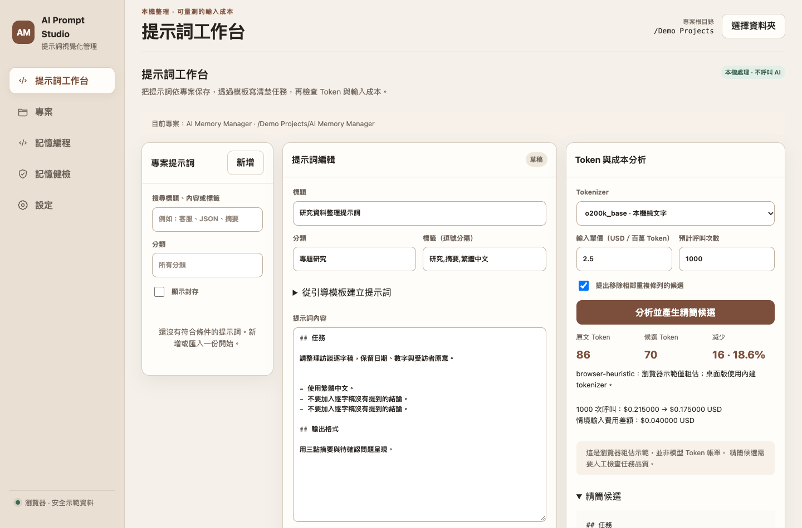
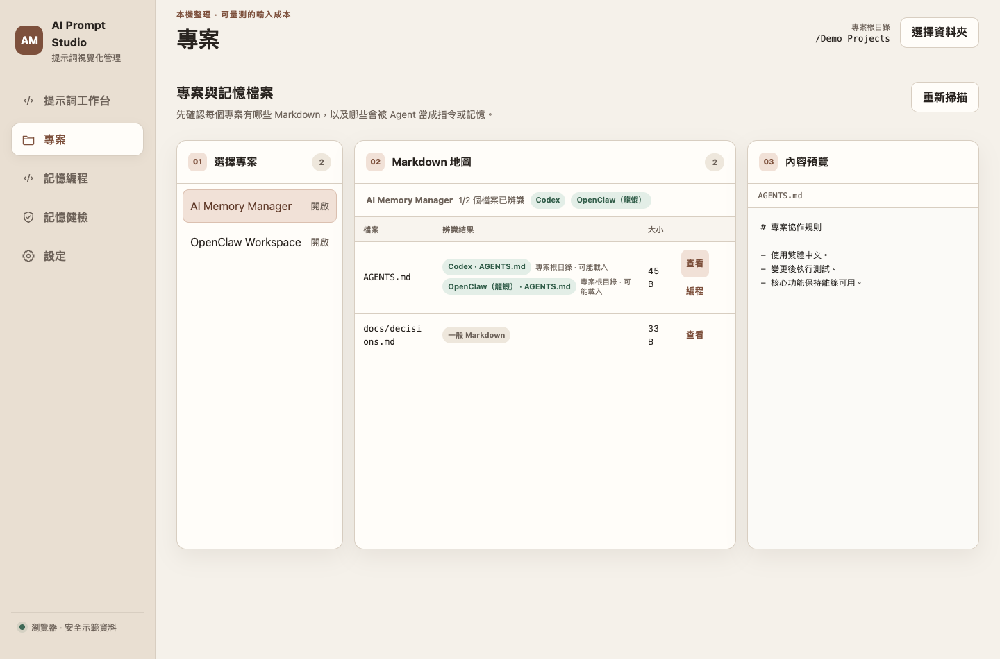
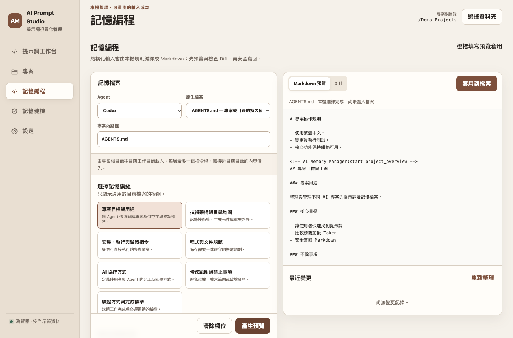
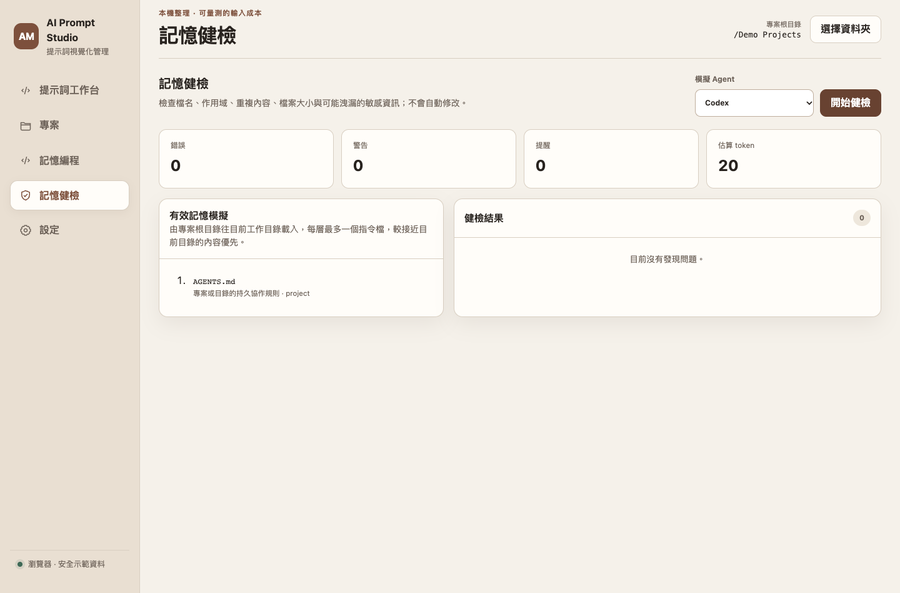

# AI Prompt Studio

AI Prompt Studio 是一套以「專案」為單位的 AI 提示詞與 Agent 記憶視覺化管理工具。使用者可以在同一個介面中整理 Prompt、查看版本、估算 Token、瀏覽專案 Markdown 檔案，並以結構化表單產生 Agent 指令與記憶內容。

本專案以 macOS 桌面 App 為主要使用情境，核心功能在本機離線執行，不需要 API Key，也不會為了整理內容額外消耗 AI Token。



## 專案目標

目前使用 AI 時常見的問題包括：

- 提示詞散落在記事本、聊天紀錄與不同專案中，難以分類與重複使用。
- 不熟悉 Prompt 結構的使用者，不知道應該提供哪些資訊。
- Prompt 內容不斷累加，容易產生重複敘述與不必要的 Token 成本。
- 不同 AI Agent 使用不同的指令與記憶檔案，實際載入範圍不透明。
- 修改 Markdown 記憶檔後缺少 Diff、備份與復原機制。

AI Prompt Studio 將上述流程整理成視覺化介面，讓使用者能以較低的學習成本管理 Prompt 與 AI 記憶。

## 主要功能

### Prompt 工作台

- 依專案管理 Prompt，支援標題、分類、標籤與搜尋。
- 提供一般問答、內容創作、程式開發與資料分析等引導情境。
- 保存版本紀錄，可查看舊版本並復原。
- 支援 Markdown 匯入與匯出。
- 使用本機 tokenizer 估算 `o200k_base` 與 `cl100k_base` Token 數量。
- 顯示可選的重複條列與格式精簡建議，不宣稱取代 LLM 的語意改寫。

### 專案與 Agent 記憶管理

- 掃描使用者選定的專案資料夾與 Markdown 檔案。
- 正式支援 Codex、Claude Code、Gemini CLI 與 OpenClaw。
- 辨識 `AGENTS.md`、`CLAUDE.md`、`GEMINI.md`、`MEMORY.md` 等原生檔案。
- 顯示檔案作用域與目前目錄可能載入的記憶順序。
- 使用結構化表單離線產生 Markdown 模組。
- 提供 Markdown 預覽與 unified diff。
- 只更新 App 管理的區段，保留使用者手寫內容。

### 安全寫回與健檢

- 寫入前比對 SHA-256，避免覆蓋其他程式剛修改的內容。
- 使用暫存檔與 atomic replace，降低檔案損壞風險。
- 寫入前建立備份，支援變更歷史與復原。
- 防止路徑穿越與根目錄外的 symlink 存取。
- 檢查錯誤檔名、空白模組、內容膨脹與疑似敏感資料。

## 介面預覽

| Prompt 工作台 | 專案地圖 |
| --- | --- |
|  |  |

| 記憶編程 | 記憶健檢 |
| --- | --- |
|  |  |

## 系統需求

### 直接執行 App

- Apple Silicon Mac。
- 建議使用 macOS 14 或更新版本。
- 約 150 MB 可用空間，用於解壓縮 App 與保存本機資料。

目前測試版尚未使用 Apple Developer ID 簽章與 notarization，因此第一次開啟時可能出現 macOS 安全提示。

### 從原始碼執行

- macOS。
- Python 3.12。
- pip 與 Python virtual environment。
- 建置桌面 App 時需要 Xcode Command Line Tools 提供的 `codesign`。

## 安裝方式

### 方法一：下載已打包的 macOS 測試版

1. 下載 [`deliverables/AI Prompt Studio Next.zip`](deliverables/AI%20Prompt%20Studio%20Next.zip)。
2. 解壓縮後取得 `AI Prompt Studio Next.app`。
3. 將 App 移動到「應用程式」資料夾，或直接在目前位置執行。
4. 第一次開啟若被 macOS 阻擋，請在 Finder 對 App 按右鍵，選擇「打開」，再確認一次。

> 此測試版只適用於 macOS，尚未提供 Windows 安裝檔。

### 方法二：從原始碼安裝

```bash
git clone https://github.com/61310118george/ai-prompt-studio.git
cd ai-prompt-studio
python3 -m venv .venv
source .venv/bin/activate
python -m pip install --upgrade pip
pip install -r requirements.txt
PYTHONPATH=src python -m ai_memory_app
```

也可以使用專案入口檔：

```bash
PYTHONPATH=src python run_app.py
```

舊版 PySide6 介面仍保留作為回退入口：

```bash
PYTHONPATH=src python run_legacy_app.py
```

## 基本操作流程

1. 開啟 App，建立或選擇 Prompt 專案。
2. 在 Prompt 工作台新增標題、分類、標籤與內容。
3. 選擇引導情境，依欄位補齊角色、任務、限制與輸出格式。
4. 查看 Token 估算與精簡候選，再保存新版本。
5. 若要管理 Agent 記憶，進入「專案」並選擇本機專案資料夾。
6. 在「記憶編程」選擇 Agent、目標檔案與模組，填寫表單後產生預覽。
7. 檢查 Diff，確認後再套用到 Markdown 檔案。
8. 可從變更歷史查看備份或復原內容。

## 瀏覽器 UI 預覽

Web 版主要用於設計與展示 UI，可直接啟動本機靜態伺服器：

```bash
python3 -m http.server 4173 --directory .
```

接著開啟：

```text
http://127.0.0.1:4173/web-preview/
```

瀏覽器模式使用示範資料與瀏覽器儲存空間，不會直接讀取 SQLite 或修改真實專案檔案。桌面 App 才會透過 Python bridge 操作本機資料。

## 專案結構

```text
ai-prompt-studio/
├── src/ai_memory_app/       # Python 桌面 App、資料層與服務層
├── web-preview/             # 桌面版與瀏覽器共用的 Web UI
├── resources/               # Agent 規格、tokenizer 與字型資源
├── tests/                   # 單元測試與整合測試
├── scripts/                 # 打包、文件產生、基準與 smoke test
├── docs/                    # 需求、設計、決策、風險與研究文件
├── output/                  # Word 與 PDF 正式文件
├── deliverables/            # HTML 文件與 macOS App 壓縮檔
├── run_app.py               # Next 桌面版入口
├── run_legacy_app.py        # 舊 PySide6 介面入口
└── requirements.txt         # 執行環境套件
```

## 測試

安裝開發套件：

```bash
pip install -r requirements-dev.txt
```

執行全部測試：

```bash
PYTHONPATH=src pytest -q
```

或使用 Python 內建 unittest：

```bash
PYTHONPATH=src python -m unittest discover -s tests -v
```

目前驗收涵蓋資料庫 migration、Markdown compiler、安全寫回、外部修改偵測、備份復原、路徑穿越防護與四種 Agent 規格。

## 打包 macOS App

```bash
bash scripts/build_macos_app.sh
```

輸出位置：

```text
dist/AI Prompt Studio Next.app
```

建置腳本會安裝 PyInstaller、檢查 tokenizer 資源、建立 App bundle、驗證簽章結構並執行 self-test。正式發佈前仍需要 Apple Developer ID 簽章與 notarization。

## 本機資料與隱私

SQLite 資料庫預設儲存在：

```text
~/Library/Application Support/AI Personal Memory Manager/ai_memory_app.sqlite3
```

檔案備份預設儲存在：

```text
~/Library/Application Support/AI Personal Memory Manager/backups/
```

- 核心功能可完全離線使用。
- App 不會把 API Key 寫入記憶檔或 SQLite。
- 使用者必須主動選擇專案根目錄，App 才會讀取其中的 Markdown。
- 瀏覽器示範版不會存取真實專案資料夾。

測試時可使用 `AI_MEMORY_APP_DB_PATH` 指定獨立資料庫，避免碰觸正式資料。

## 專題文件

- [完整企劃書](docs/專題企劃書.md)
- [可編輯企劃書 Word](output/word/AI提示詞視覺化管理App_完整企劃書.docx)
- [精簡易讀版企劃書 Word](output/word/AI提示詞視覺化管理App_完整企劃書_精簡易讀版.docx)
- [企劃書 PDF](output/pdf/AI提示詞視覺化管理App_完整企劃書.pdf)
- [軟體需求與技術 Spec](docs/SPEC.md)
- [可編輯 Spec Word](output/word/AI提示詞視覺化管理App_軟體需求規格書.docx)
- [Spec PDF](output/pdf/AI提示詞視覺化管理App_軟體需求規格書.pdf)
- [App 介紹](docs/app-introduction.md)
- [資訊架構](docs/app-information-architecture.md)
- [需求與範圍](docs/requirements.md)
- [資料庫設計](docs/database-schema.md)
- [技術與產品決策](docs/decisions.md)
- [風險評估](docs/risks.md)
- [研究與 Demo 指南](docs/研究與展示指南.md)
- [目前符合度與交付紀錄](docs/現況符合度與交付紀錄.md)

## 常見問題

### 為什麼雙擊 App 沒有反應？

目前是未公證的測試版。請在 Finder 對 App 按右鍵並選擇「打開」。如果 App 檔案在雲端同步資料夾，請先完整下載到本機。

### 為什麼瀏覽器版不能選擇真實資料夾？

瀏覽器版是 UI 展示與開發模式，沒有桌面 App 的 Python bridge。請使用 macOS App 才能掃描專案、寫回 Markdown、備份與復原。

### Token 數量是否等於 API 帳單？

不一定。App 計算的是純文字 tokenizer 結果，不包含聊天訊息封裝、工具呼叫、圖片、模型輸出與各平台額外計費項目，應視為輸入內容的比較依據。

### 是否一定要設定 OpenAI API Key？

不需要。Prompt 管理、Token 估算、記憶編程、Diff、健檢、備份與復原都可以離線使用。

## 已知限制

- 目前正式打包版本只支援 Apple Silicon macOS。
- 尚未完成 Apple Developer ID 簽章與 notarization。
- 規則式整理器負責格式化與結構化，不會像 LLM 一樣理解任意自然語言。
- 瀏覽器示範資料不會與桌面版 SQLite 自動同步。
- GitHub Copilot、Cursor 與 Windsurf 目前屬於相容性資料，尚未列入第一階段完整支援。

## 授權與第三方資料

本專案使用的第三方資源、字型、tokenizer 與建置說明整理於 [第三方來源與建置說明](docs/第三方來源與建置說明.md)。正式對外公開或商業使用前，請依專案需求補上主程式授權條款。
