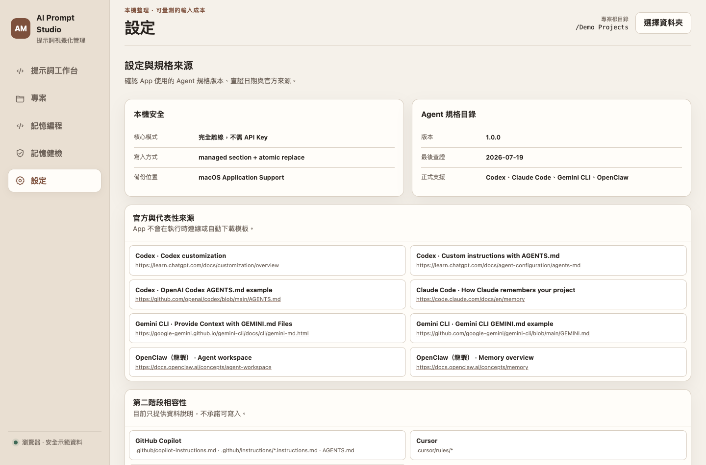

# AI Prompt Studio：軟體需求與技術規格

版本：1.2｜同步日期：2026-09-26｜狀態：本機單人 MVP 桌面交付基準

交付形式：`dist/AI Prompt Studio Next.app`。桌面版直接內嵌最終 `web-preview/`，不是另外重寫或只開外部網站；五個功能區（提示詞、專案、記憶編程、記憶健檢、設定）共用同一份前端。瀏覽器使用示範資料，App 使用 Python bridge、SQLite 與真實本機檔案。桌面包內附兩種 tokenizer 資料，核心執行不需要網路。

本文件定義新主題「AI 提示詞視覺化管理 App」的工程範圍。未列為已實作的研究或擴充功能，不得出現在成果中當作已完成能力。企劃書說明為何做，本文件說明系統必須如何運作與如何驗收。

## 1. 產品邊界與名詞

提示詞：使用者準備提供给 AI 的純文字內容，可包含任務、背景、限制、格式與程式碼。Agent 記憶檔：由特定工具依規則讀取的持久指令檔。資料庫版本：每次儲存的完整提示詞快照。檔案備份：對已存在 Markdown 寫回前保留的原始檔案。

精確純文字 Token 計數：在指定 encoding 與本機版本下編碼的整數長度；不等同供應商完整 request usage。粗估：無特定模型保證的啟發式數字。情境成本：以使用者單價推算的未快取純文字輸入費用。

第一版使用者為單人 macOS 使用者；瀏覽器提供共用 UI 的示範環境。核心不需 API Key、雲端帳號或模型推論。新版顯示名稱為 AI Prompt Studio，Python 套件名稱暫保留 ai_memory_app 以降低遷移風險。

## 2. 功能需求與優先級

P0 為必要交付；P1 為保留的輔助能力；P2 為後續候選，不影響本期完成判定。

| ID | 優先 | 需求 | 驗收要點 |
|---|---|---|---|
| FR-01 | P0 | 選擇根目錄、開啟根目錄或子專案 | 空資料夾也能成為專案 |
| FR-02 | P0 | 掃描與預覽 Markdown | 一般 .md 可看，不誤認為所有 Agent 自動記憶 |
| FR-03 | P0 | 建立與編輯專案提示詞 | 標題與內容必填，跨專案不可覆寫 |
| FR-04 | P0 | 搜尋、分類與標籤 | 搜尋包含標題、內容、分類、標籤，大小寫不敏感 |
| FR-05 | P0 | 引導式模板 | 角色、任務、背景、限制、格式；任務為必要輸入 |
| FR-06 | P0 | 保存版本與帶回歷史 | 新儲存產生版本，不刪歷史；陳舊版本被拒絕 |
| FR-07 | P0 | 封存與取消封存 | 默认列表隱藏封存，封存不刪除資料 |
| FR-08 | P0 | Markdown 匯入為草稿 | 不自動覆蓋原始檔案或現有資料庫版本 |
| FR-09 | P0 | 本機 Token 計數 | o200k_base、cl100k_base；缺資料可明確降級粗估 |
| FR-10 | P0 | 精簡候選與 Diff | 預設合併空白行，可選相鄰同文條列；保留 code fence |
| FR-11 | P0 | 情境成本分析 | 必須有單價才顯示費用，單位為 USD／百萬 Token |
| FR-12 | P0 | 分析報告 | 可下載 JSON，包含原文、候選、方法、數據、警告 |
| FR-13 | P0 | 匯出預覽與安全寫回 | 檔案存在狀態及 SHA-256 均須一致 |
| FR-14 | P0 | 備份與復原 | 不覆蓋套用後的外部變更，既有檔逐位元組還原 |
| FR-15 | P1 | Agent 記憶模組 | 既有 4 Agent、15 模組沿用，內建規格日期可見 |
| FR-16 | P1 | 基本記憶健檢 | 檔名、重複文字、長度、空檔、疑似憑證 |
| FR-17 | P2 | 真實模型品質評測面板 | 本期以研究腳本／人工記錄規畫，不內建 API 呼叫 |
| FR-18 | P2 | 多人同步與跨平台發布 | 不屬本期 macOS 單人 MVP |

## 3. 使用情境與狀態

### UC-01 建立並重用提示詞

前置：選定專案。使用者新增草稿，填標題、分類、標籤与內容，或使用引導模板產生草稿；按儲存後取得 id 與版本號。重新進入同專案可搜尋與開啟。欄位不完整時顯示原因，內容保留在畫面。

### UC-02 分析與採用精簡候選

使用者選 tokenizer、可選單價、呼叫次數與去重選項，按分析後得到原文／候選 Token、差異、成本與警告。僅在選擇「將候選帶回草稿」後變更編輯器，仍需另按儲存才寫入資料庫。任何影響內容或計算的輸入變更皆使先前分析失效。

### UC-03 匯入、匯出與復原

從目前掃描清單選 Markdown 匯入為草稿。匯出時輸入專案內 `.md` 相對路徑，先取得 Diff；若目標已存在，必須確認整份替換。套用前重新讀取目標、核對 hash 與存在狀態。成功後回傳 change_id；同次工作台可一鍵復原，持久歷史亦記錄於既有變更表。

### UC-04 歷史恢復

打開提示詞後顯示各版本。點選歷史版本只將其內容帶回草稿，保留當前版本號作為更新前置條件；儲存時建立下一版。若其他視窗先儲存，更新需被拒絕而非覆蓋。

### 狀態模型

草稿 → 已分析 → 候選帶回草稿 → 已儲存版本。編輯草稿／分析條件後回到未分析。匯出另為未預覽 → 已預覽 → 已套用／衝突 → 已復原。資料庫儲存與檔案匯出是兩個明確操作，不隱含自動雙向同步。

## 4. 導航與介面

主導航為「提示詞工作台、專案、記憶編程、記憶健檢、設定」。新增工作台為預設入口，左欄顯示專案提示詞，中央編輯／模板／版本，右欄分析／候選／差異。視窗較窄時改為兩欄或單欄；不能依靠橫向捲動才能看到主要操作。

畫面直接區分「儲存版本」「產生候選」「帶回草稿」「預覽檔案變更」「套用匯出」。按鈕不得將分析動作誤導為已完成檔案修改。HTML 顯示使用 textContent 或 escaping；使用者提示詞不作為 HTML 執行。

瀏覽器模式顯示安全示範標記，提示詞存於該瀏覽器 localStorage，Token 標為粗估，檔案匯出提示需使用桌面版。不能假裝 mock 已寫入本機專案。

### 4.1 畫面規格與用途

本節依照「畫面目的、主要控制、回饋與限制」記錄介面，不以「好看、直覺」等無法驗證的形容詞作為需求。圖片使用瀏覽器安全示範資料；桌面 App 內嵌相同前端，執行環境標籤與可用能力則由 bridge 判斷。

| 畫面 | 目的 | 主要操作 | 必要回饋 |
|---|---|---|---|
| 提示詞工作台 | 管理提示詞並看見輸入成本 | 新增、搜尋、分類、儲存版本、分析、帶回候選、匯入／匯出 | 草稿／版本狀態、Token 方法、差異、警告、成本範圍 |
| 專案 | 檢視根目錄內 Markdown 與 Agent 辨識結果 | 選專案、重新掃描、預覽、進入編程 | 檔案數、辨識平台、作用域、載入狀態 |
| 記憶編程 | 用結構化欄位產生受管理 Markdown | 選 Agent／檔案／模組、填表、預覽、Diff、套用 | 尚未寫入、必填警告、寫入成功、變更紀錄 |
| 記憶健檢 | 顯示有效記憶與問題 | 選 Agent、開始健檢 | 錯誤／警告／提醒數、估算 Token、有效檔案順序 |
| 設定 | 查閱安全方式與規格來源 | 查看版本與官方連結 | 規格版本、查證日期、正式／未正式支援範圍 |

圖 S-1　提示詞工作台的三欄配置。驗收重點：主要動作在 1440 px 可同時看見；編輯內容或分析條件後，舊候選必須失效；沒有單價時不得顯示推測費用。瀏覽器截圖中的 browser-heuristic 是示範模式，桌面版應顯示所選本機 tokenizer。

圖 S-2　專案檔案地圖。驗收重點：未辨識檔案標為一般 Markdown；同一檔案可同時顯示多個平台分類；預覽不得執行檔案中的 HTML 或指令。

圖 S-3　記憶編程與 Markdown 預覽。驗收重點：右側結果在按下「套用到檔案」前只屬預覽；切換 Diff 不改檔；必要欄位缺少時停用套用。

圖 S-4　有效記憶模擬與健檢。驗收重點：健檢為唯讀；使用者切換 Agent 後重新計算；估算 Token 不得標成 API 帳單。

圖 S-5　設定與規格來源。驗收重點：每個正式支援 Agent 至少顯示一個來源；版本與查證日期不得留白；第二階段平台不得誤標為已支援寫入。

### 4.2 基本操作流程

提示詞：選專案 → 新增／匯入 → 編輯 → 儲存版本 → 選 tokenizer → 分析 → 查看候選與 Diff → 帶回草稿 → 再存一版 → 視需要預覽並匯出。

記憶檔：選專案 → 查看辨識結果 → 進入記憶編程 → 選平台與模組 → 填表 → 產生預覽 → 查看 Diff → 套用 → 在最近變更中復原。

任何會修改檔案的流程都必須經過預覽；任何只做分析的按鈕都不能造成資料庫或檔案寫入。

## 5. 技術架構

前端：原生 HTML、CSS、JavaScript ES modules；app.js 處理既有流程，prompt-workspace.js 處理新增工作台。

桌面：pywebview／macOS WebKit。AppBridge 等待 bridge 方法準備完成，再選桌面或 mock。

服務：DesktopApi 暴露結構化 API；prompt_workbench.py 做純文字分析；PromptLibrary 提供交易化版本保存；既有掃描、compiler、健檢與備份服務沿用。

持久層：SQLite、使用者專案 Markdown、Application Support 備份。版本化 tokenizer 資料隨 resources 打包。開發時可連網下載套件與準備 tokenizer；執行期計數直接讀本機資料，不使用 tiktoken URL registry。

## 6. 資料規格與 migration

### prompt_library

| 欄位 | 型別／規則 | 說明 |
|---|---|---|
| id | INTEGER PK | 提示詞識別碼 |
| project_path | TEXT NOT NULL | 解析後的授權專案路徑 |
| title | TEXT，1–200 字 | 名稱 |
| content | TEXT，非空且最多 200,000 字元 | 原始提示詞 |
| category | TEXT，最多 100 字 | 分類 |
| tags | TEXT，最多 500 字 | 逗號分隔標籤 |
| version | INTEGER，自 1 遞增 | 並行更新檢查 |
| archived | 0／1 | 可回復封存 |
| created_at／updated_at | UTC ISO 字串 | 時間 |

### prompt_revisions

欄位為 id、prompt_id、version、title、content、category、tags、created_at。prompt_id 對應 prompt_library；(prompt_id, version) 唯一。版本記錄完整文字快照，不是僅存 Diff。

schema_migrations 新增版本 3。新表採 additive schema；舊 memory_items、memory_versions、prompt_templates、ai_processing_runs、memory_file_changes 均保留。舊提示詞資料未自動合併進新表，避免類別語意與專案對應不明；需要時可從舊入口匯出再匯入。

初始化 settings 改為 INSERT OR IGNORE，避免每次啟動重置使用者設定。資料庫實際路徑保持相容；測試透過 AI_MEMORY_APP_DB_PATH 使用獨立 DB。

## 7. API 合約

統一回應：`{ok: boolean, data: object|array|null, error: string|null}`。前端不得在 ok=false 時繼續套用。公開 API 不執行使用者提供的 shell 命令。

| 方法 | 輸入 | 成功輸出 |
|---|---|---|
| list_prompts | project_path, query, category, archived | 提示詞列表 |
| save_prompt | project_path, id?, version?, title, content, category, tags, archived | 新提示詞狀態與版本 |
| list_prompt_versions | project_path, prompt_id | 歷史快照，版本倒序 |
| analyze_prompt | content, encoding, input_price?, calls, remove_duplicates | 分析結果 |
| preview_prompt_file | project_path, relative_path, content | original, compiled, exists, base_hash, diff |
| apply_prompt_file | 前述請求＋base_hash, expected_exists, confirm_replace | change_id, relative_path |
| restore_change | change_id | 復原結果 |

既有 choose_project_root、list_projects、scan_project、read_memory_file、get_agent_catalog、compile_memory_module、apply_memory_change、list_change_history、run_memory_health_check 持續提供。

AnalyzeResult 必含 original、candidate、before／after（count、method、exact_text）、saved_tokens、saved_percent、changes、warnings、base_hash、diff、cost。cost 未設定價格時為 null；其餘包含 USD、單價、呼叫數、前後費用與計算範圍文字。

## 8. 分析演算法與限制

Tokenizer 僅接受 o200k_base、cl100k_base、estimate。特殊 token 外觀字串按普通內容編碼，不讓使用者文字觸發控制 token 處理。資源不存在或依賴不可用時回傳明確粗估狀態。

粗估公式為 ASCII 字元權重 1、非 ASCII 權重 4，加總後除以 4 向上取整。此為顯示回退，不保證對中文、emoji 或任何特定供應商準確。

精簡規則：保留非空文字原樣；code fence 內保留換行與重複程式；連續空白行最多留一行；僅當選項開啟時移除相鄰完全相同的頂層 `-`、`*`、`+` 條列。跨段落、數字清單或近義句不自動去重。不解析所有 Markdown 方言，因此複雜巢狀結構仍需人工看 Diff。

若計數不減少則不宣稱節省；若增加則退回原文。單价須為有限非負數；calls 為 1–10,000,000 整數。關鍵字引導與疑似秘密提醒皆為啟發式，不是語意衝突判定或安全保證。

## 9. 安全寫回與一致性

指定路徑只能為專案內相對 `.md`，拒絕絕對路徑、`..`、直接 symlink 目標與經父層 symlink 越界。掃描排除指向根外的檔案。備份檔案保留在 Application Support。

寫回前檢查預覽時 hash 與 exists 狀態；可防止「原先不存在、後來建立空檔」也被同一空 hash 忽略。復原檢查目前內容仍等於本次輸出；既有檔從原備份 UTF-8 bytes 還原，包含 CRLF。一般提示詞匯出屬整檔替換，不能描述成 managed section 更新。

目前不是跨程序分散式鎖。hash 核對到 atomic replace 之間仍有極短競態窗口；磁碟寫入與 SQLite 記錄也不是同一原子交易。第一版對同一檔案使用者應避免並行寫入，這是已知限制，不宣稱完整多程序 ACID。後續可加入 per-path lock 與 pending journal。

## 10. 非功能需求

NFR-01：核心保存、計數、精簡不發出模型 API 請求；缺少 tokenizer 資源時回退粗估而非偷偷下載。

NFR-02：保留 Unicode 文字、Markdown 程式碼及既有資料；未確認的預覽不直接改檔。

NFR-03：新頁面所有欄位有文字標籤，鍵盤可達，顯示焦點；小螢幕採單欄，不以圖示單獨表示重要操作。

NFR-04：輸入長度上限 200,000 字元；性能目標是在基準機器上，10,000 字提示詞暖啟動分析於 1 秒內。硬體、冷／暖啟動與實測需記錄，不跨機器保證。

NFR-05：SQLite 檔案在正常重啟後資料持續存在；版本更新具交易保護，錯誤不應留下半筆版本。

NFR-06：網路來源與 Agent catalog 日期可見。2026-07-19 的舊 catalog 不能標示為 2026-09-25 已全面重驗。

## 11. 測試與追蹤

| 驗收 ID | 關聯需求 | 方法與通過條件 |
|---|---|---|
| AC-01 | FR-01/03 | 空根目錄可選，建立提示詞後可找回 |
| AC-02 | FR-04/07 | 依關鍵字／分類過濾，封存切換結果正確 |
| AC-03 | FR-06 | 版本遞增，旧 version 拒絕，跨專案更新拒絕 |
| AC-04 | FR-09 | 禁止 socket 時兩種內建 tokenizer 仍可計數 |
| AC-05 | FR-10 | 程式碼與變数不被刪除；預設不去重條列 |
| AC-06 | FR-11 | 價格、次數、差額公式正確，負數／NaN／非整數被拒絕 |
| AC-07 | FR-13 | 衝突 hash、檔案存在狀態改變與越界拒絕 |
| AC-08 | FR-14 | 套用後復原 bytes 與原檔相同 |
| AC-09 | migration | 版本 3 表存在，舊資料與使用者設定保留 |
| AC-10 | UI | 模板→儲存→搜尋→分析→候選→歷史；桌面與窄螢幕無阻塞錯誤 |
| AC-11 | FR-12 | 報告 JSON 可解析，明示計數與成本範圍 |
| AC-12 | 打包 | pywebview、前端與 tokenizer 資源被包含，App 可啟動 |

自動測試位於 tests/test_prompt_studio.py 與既有 tests；Token 基準位於 scripts/benchmark_prompts.py。UI 冒煙測試與檢查證據記錄在 docs/evidence。軟體測試通過不等同 RQ1–RQ4 的使用者研究完成。

## 12. 發布與回退

輸出平行測試版 `dist/AI Prompt Studio Next.app`，不取代搬移備份中的舊 App。保留 run_legacy_app.py。此工作區從搬移的原專案複製原始碼建立，沒有複製舊 build、dist 或使用者的 DB，因此新安裝仍沿用既有 Application Support DB 或指定測試 DB。

本地 ad-hoc codesign 只能驗證封裝完整性，不等同 Apple Developer ID 與 notarization。正式對外發布、Windows/Linux 適配、團隊同步與付費 API 實验各需獨立決策。

## 13. 已知差距與後續

現有 Agent 健檢仍是近似載入模擬，沒有完整解析所有平台的 override、import、global config 與執行時權限；也未实现任意自然語言矛盾辨識。設定目前提供規格與來源展示，尚未完整提供備份保留數、介面偏好與預設根目錄管理。這些早期 2.0 規畫內容不能因既有完成報告而視為全部已驗收。

本期核心優先對齊給老師的提示詞管理與 Token 分析主題。研究資料、真人評估、品質對照結果、最終簡報與學校格式，待取得真實資料後再完成，不生成虛構實驗結論。

## 14. 參考依據與使用範圍

- ISO/IEC/IEEE 29148 公開介紹：https://www.iso.org/obp/ui?_escaped_fragment_=iso%3Astd%3Aiso-iec-ieee%3A29148%3Aed-2%3Av1%3Aen
- 南臺科技大學軟體工程教材，軟體需求規格格式：https://faculty.stust.edu.tw/~pwchen/se/Chapter02.pdf
- 國立東華大學資訊管理學系專題製作規定：https://im.ndhu.edu.tw/var/file/50/1050/img/4912/675555425.pdf
